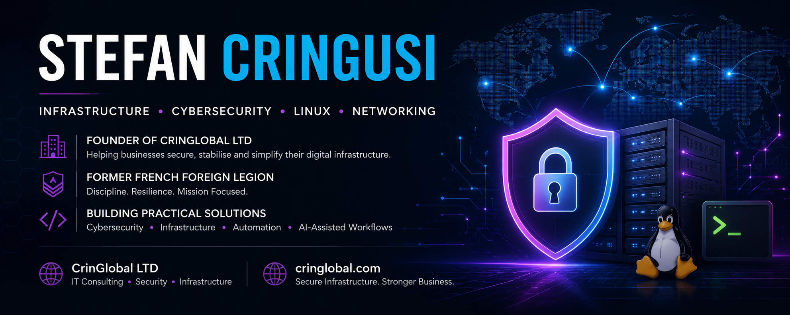

  

# Hi, I'm Stefan Cringusi

Founder of CrinGlobal LTD and a technology professional focused on infrastructure, cybersecurity, Linux systems, networking, automation, and practical IT solutions.

---

# Featured Projects

## [LegionTrap TI](https://github.com/stecrin/legiontrap-ti)

A modular cybersecurity honeynet and threat intelligence platform focused on privacy-aware event handling, ATT&CK mapping, detection engineering, and defensive visibility.

---

## [AI Development OS](https://github.com/stecrin/ai-development-os)

A structured AI-assisted development framework designed to improve software delivery through documentation, governance, memory systems, approval workflows, and operational safeguards.

---

## [macOS VPN Network Reset](https://github.com/stecrin/macos-vpn-network-reset)

A practical recovery utility designed to diagnose and repair VPN, DNS, routing, and connectivity issues on macOS systems.

---

## [ChatGPT Word View](https://github.com/stecrin/chatgpt-word-view)

A TypeScript browser tool focused on improving readability and long-form document workflows when working with ChatGPT.

---

# Areas of Focus

- Infrastructure & Systems Administration
- Cybersecurity & Risk Reduction
- Linux & Server Management
- Networking & Troubleshooting
- Secure Automation & AI-Assisted Workflows
- Small Business IT Solutions

---

# Professional Background

- Founder of CrinGlobal LTD
- Former French Foreign Legion
- Building practical cybersecurity, infrastructure, and automation solutions
- Passionate about continuous learning and real-world problem solving

---

# Technology

### Infrastructure
Linux, Networking, System Administration, Virtualisation, Infrastructure Security

### Cybersecurity
Hardening, Risk Reduction, Threat Intelligence, Security Operations, Security Reviews

### Development
Python, JavaScript, TypeScript, Automation

### Cloud & Platforms
Docker, DigitalOcean, GitHub, Self-Hosted Services

---

# Company

CrinGlobal LTD helps organisations secure, stabilise, and simplify their digital infrastructure through practical technology solutions.

**Website:** https://cringlobal.com

---

# Connect

**Personal Website:** https://stefancringusi.com

**LinkedIn:** https://linkedin.com/in/stefan-cringusi

**Company:** https://cringlobal.com

---

### Current Focus

Building practical solutions across:

- Cybersecurity
- Infrastructure
- Linux Systems
- Networking
- Automation
- AI-Assisted Operations

while continuing to expand expertise in modern infrastructure, security operations, and business technology.

---

*"Secure what matters. Stabilise what is critical. Build for growth."*
